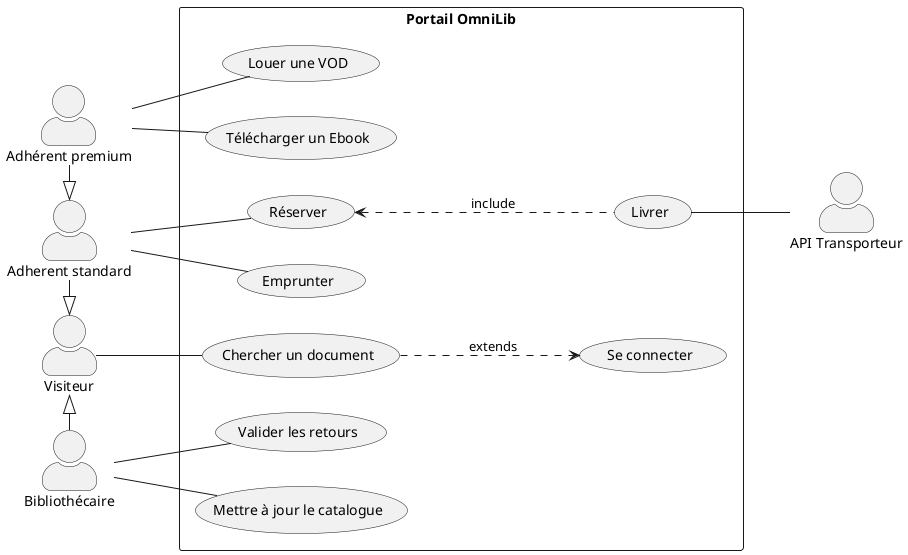
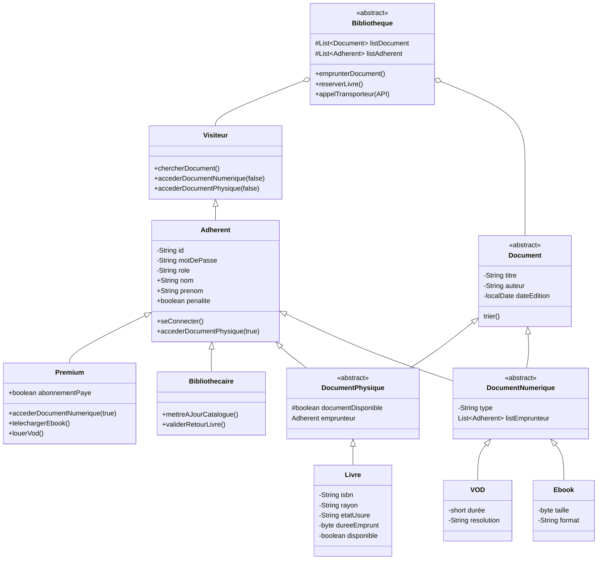
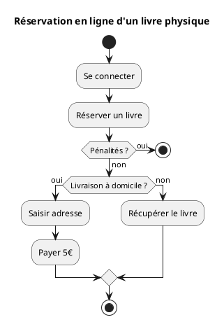

---
tags:
  - Conception
---
# Diagramme de cas d'utilisation

```plantuml

@startuml
skinparam actorStyle awesome
left to right direction

together {
actor "Visiteur" as visiteur
actor "Adherent standard" as adherent
actor "Adhérent premium" as premium
actor "Bibliothécaire" as bibi
}


visiteur <|- adherent
adherent <|- premium
bibi -|> visiteur

rectangle "Portail OmniLib"{
	usecase "Chercher un document" as UC_chercher
	usecase "Se connecter" as UC_connecter
	
	visiteur -- UC_chercher
	UC_chercher -.-> UC_connecter :extends
	
	usecase "Emprunter" as UC_emprunter
	usecase "Réserver" as UC_reserver
	usecase "Livrer" as UC_livrer
	
	
	adherent -- UC_emprunter
	adherent -- UC_reserver
	UC_reserver <-.- UC_livrer :include
	
	usecase "Télécharger un Ebook" as UC_Ebook
	usecase "Louer une VOD" as UC_VOD
	
	premium  -- UC_Ebook
	premium  -- UC_VOD	
	
	usecase "Mettre à jour le catalogue" as UC_MAJCata
	usecase "Valider les retours" as UC_retour
	
	bibi -- UC_MAJCata
	bibi -- UC_retour
		
}

together {
	actor "API Transporteur" as transporteur
	}
	
	UC_livrer -- transporteur
@enduml
```

# Diagramme de classes

```mermaid

classDiagram
	
	
	class Bibliotheque{
		<<abstract>>
		#List~Document~ listDocument
		#List~Adherent~ listAdherent
		
		+emprunterDocument()
		+reserverLivre()
		+appelTransporteur(API)
	}
	
	class Visiteur{
		+chercherDocument()
		+accederDocumentNumerique(false)
		+accederDocumentPhysique(false)
	}
	class Adherent {
		-String id
		-String motDePasse
		-String role
		+String nom
		+String prenom
		+boolean penalite
		
		+seConnecter()
		+accederDocumentPhysique(true)
	}
	
	class Premium{
		+boolean abonnementPaye
		
		+accederDocumentNumerique(true)
		+telechargerEbook()
		+louerVod()
	}
	
	class Bibliothecaire{ 
		+mettreAJourCatalogue()
		+validerRetourLivre()
		
	}
	
	Visiteur <|-- Adherent
	Adherent <|-- Premium
	Adherent <|-- Bibliothecaire
	Bibliotheque o-- Visiteur
	Bibliotheque o-- Document	
	
	class Document{
		<<abstract>>
		-String titre
		-String auteur
		-localDate dateEdition
		trier()
	}
	
	class DocumentNumerique {
		<<abstract>>
		-String type
		List~Adherent~ listEmprunteur
	}
	
	class DocumentPhysique {
		<<abstract>>
		#boolean documentDisponible
		Adherent emprunteur
		
	}
	
	class Livre {
		-String isbn
		-String rayon
		-String etatUsure
		-byte dureeEmprunt
		-boolean disponible 
	}
	
	class VOD {
		-short durée
		-String resolution
	}
	
	class Ebook {
		-byte taille
		-String format
	}
	
	Document <|-- DocumentPhysique
	DocumentPhysique <|-- Livre
	Document <|-- DocumentNumerique
	DocumentNumerique <|-- VOD
	DocumentNumerique <|-- Ebook
	Adherent <|-- DocumentPhysique
	Adherent <|-- DocumentNumerique
	
```

# Diagramme d'Activité

## Réservation en ligne d'un livre physique

```plantuml
@startuml
title Réservation en ligne d'un livre physique
start 
:Se connecter;
:Réserver un livre;
if (Pénalités ?) then (oui)
stop
else (non)
if (Livraison à domicile ?) then (oui)
:Saisir adresse;
:Payer 5€;
else (non)
:Récupérer le livre;
endif
stop
@enduml
```

