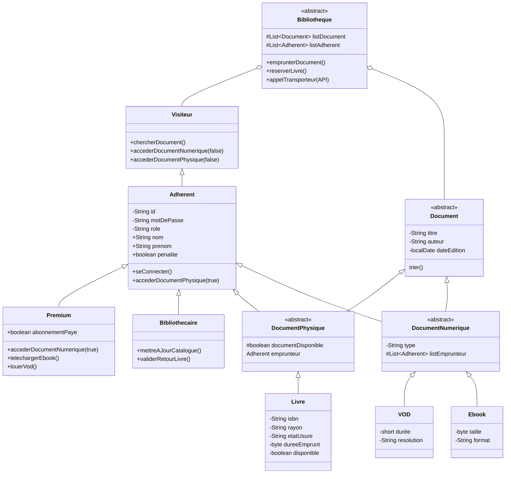

# OmniLib-UML-
Practice of UML diagrams

## [User Stories](userStories.md)

## Diagramme de cas d'utilisation

  

## Diagramme de classe

```mermaid

classDiagram
	
	class Bibliotheque {
		<<abstract>>
		#List~Document~ listDocument
		#List~Adherent~ listAdherent
		
		+emprunterDocument()
		+reserverLivre()
		+appelTransporteur(API)
	}
	
	class Visiteur {
		+chercherDocument()
		+accederDocumentNumerique(false)
		+accederDocumentPhysique(false)
	}

	class Adherent {
		-String id
		-String motDePasse
		-String role
		+String nom
		+String prenom
		+boolean penalite
		
		+seConnecter()
		+accederDocumentPhysique(true)
	}
	
	class Premium {
		+boolean abonnementPaye
		
		+accederDocumentNumerique(true)
		+telechargerEbook()
		+louerVod()
	}
	
	class Bibliothecaire { 
		+mettreAJourCatalogue()
		+validerRetourLivre()
	}
	
	Visiteur <|-- Adherent
	Adherent <|-- Premium
	Adherent <|-- Bibliothecaire
	Bibliotheque o-- Visiteur
	Bibliotheque o-- Document	
	
	class Document {
		<<abstract>>
		-String titre
		-String auteur
		-localDate dateEdition
		
  trier()
	}
	
	class DocumentNumerique {
		<<abstract>>
		-String type
		#List~Adherent~ listEmprunteur
	}
	
	class DocumentPhysique {
		<<abstract>>
		#boolean documentDisponible
		Adherent emprunteur
	}
	
	class Livre {
		-String isbn
		-String rayon
		-String etatUsure
		-byte dureeEmprunt
		-boolean disponible 
	}
	
	class VOD {
		-short durée
		-String resolution
	}
	
	class Ebook {
		-byte taille
		-String format
	}
	
	Document <|-- DocumentPhysique
	DocumentPhysique <|-- Livre
	Document <|-- DocumentNumerique
	DocumentNumerique <|-- VOD
	DocumentNumerique <|-- Ebook
	Adherent <|-- DocumentPhysique
	Adherent <|-- DocumentNumerique
	
```

## Diagramme d'activité

 
